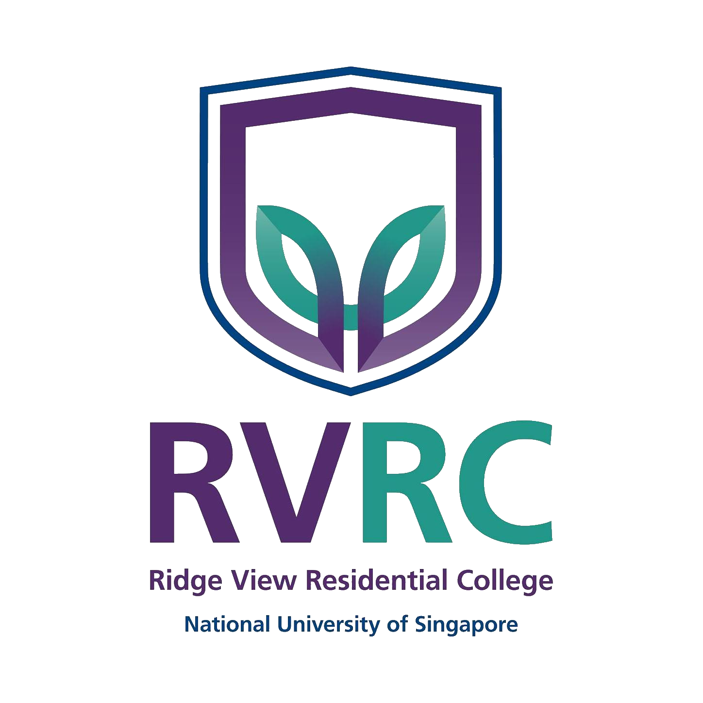
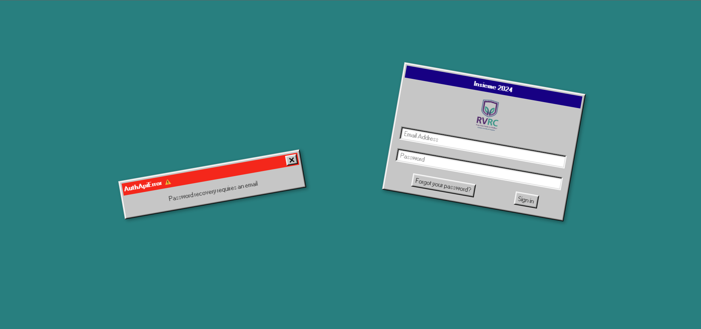
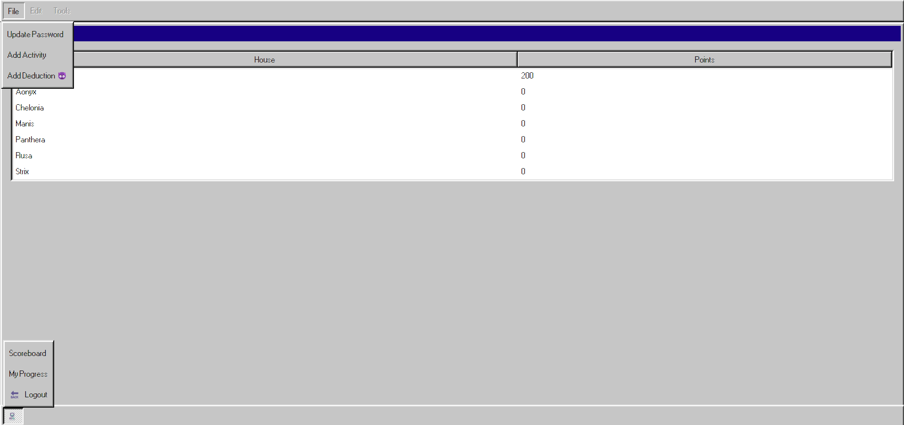

<!-- Improved compatibility of back to top link: See: https://github.com/othneildrew/Best-README-Template/pull/73 -->
<a name="readme-top"></a>
<!--
*** Thanks for checking out the Best-README-Template. If you have a suggestion
*** that would make this better, please fork the repo and create a pull request
*** or simply open an issue with the tag "enhancement".
*** Don't forget to give the project a star!
*** Thanks again! Now go create something AMAZING! :D
-->


<!-- PROJECT SHIELDS -->
<!--
*** I'm using markdown "reference style" links for readability.
*** Reference links are enclosed in brackets [ ] instead of parentheses ( ).
*** See the bottom of this document for the declaration of the reference variables
*** for contributors-url, forks-url, etc. This is an optional, concise syntax you may use.
*** https://www.markdownguide.org/basic-syntax/#reference-style-links
-->
[![Issues][issues-shield]][issues-url]
[![MIT License][license-shield]][license-url]
[![LinkedIn][linkedin-shield]][linkedin-url]


<!-- PROJECT LOGO -->
<br />
<div align="center">
  <a href="https://github.com/othneildrew/Best-README-Template">
    
  </a>

  <h3 align="center">Insieme Dashboard</h3>

  <p align="center">
    Leaderboard, dashboard for Ridge View Residential College's Freshmen Orientation Programme 2024: Insieme.
    <br />
    <a href="https://insieme.vercel.app/login">View Demo</a>
    ·
    <a href="https://github.com/nicholasohjj/rvfop_dashboard/issues">Report Bug</a>
    ·
    <a href="https://github.com/nicholasohjj/rvfop_dashboard/issues">Request Feature</a>
  </p>
</div>


<!-- TABLE OF CONTENTS -->
<details>
  <summary>Table of Contents</summary>
  <ol>
    <li>
      <a href="#about-the-project">About The Project</a>
      <ul>
        <li><a href="#built-with">Built With</a></li>
        <li><a href="#database-management">Database Management</a></li>
      </ul>
    </li>
    <li>
      <a href="#getting-started">Getting Started</a>
      <ul>
        <li><a href="#prerequisites">Prerequisites</a></li>
        <li><a href="#installation">Installation</a></li>
        <li><a href="#testing">Installation</a></li>
      </ul>
    </li>
    <li><a href="#usage">Usage</a></li>
    <li><a href="#contributing">Contributing</a></li>
    <li><a href="#license">License</a></li>
    <li><a href="#contact">Contact</a></li>
  </ol>
</details>


<!-- ABOUT THE PROJECT -->
## About The Project

<table>
  <tr>
    <td><a href="https://insieme.vercel.app/login"></a></td>
    <td><a href="https://insieme.vercel.app/login"></a></td>
  </tr>
</table>

This product serves as a dynamic leaderboard and dashboard for **Insieme**, the inaugural Freshmen Orientation Programme for Ridge View Residential College in the National University of Singapore. It is designed to enhance the engagement and competitive spirit among participants. This platform is built with the aim of fostering a sense of community and teamwork, while also streamlining the administrative tasks associated with managing the orientation programme.

Key Features:
- **Dynamic Leaderboard**: Instantly updates to reflect current standings, making the competition more exciting and engaging for participants.
- **Role-Based Access Control (RBAC)**: Implements a comprehensive RBAC system to ensure users only access features and information relevant to their roles. This system enhances security and operational efficiency by categorizing users into roles such as participants, game masters, and administrators, each with tailored access and capabilities.
- **Activity and Points Log**: Allows game masters to easily add new activities and update points, ensuring a smooth operation of the event.
- **Deduction Feature**: Enables adversarial orientation groups to apply deductions to other groups, adding a strategic element to the competition.
- **User-Friendly Interface**: Designed with the user in mind, the interface is intuitive, making navigation and usage straightforward for all participants.

Why?
- **Custom-Built for RVFOP 2024**: Tailored specifically for the needs of Ridge View Residential College's Freshmen Orientation Programme, ensuring a perfect fit for the event's requirements.
- **Enhances Participation**: By providing a real-time leaderboard, **Insieme** keeps the competitive spirit alive and keeps participants engaged throughout the programme.
- **Streamlines Administration**: Reduces the workload on organisers by automating the tracking of scores and activities.

By integrating technology with tradition, we're setting a new standard for how orientation programmes are conducted.

<p align="right">(<a href="#readme-top">back to top</a>)</p>


### Built With

* React
* Vite
* Supabase (DB and User Authentication)
* Vercel (Website Hosting)
* React95 (UI Library)
* Resend (SMTP Server)

<p align="right">(<a href="#readme-top">back to top</a>)</p>

### Database Management

<table>
  <tr>
    <td></td>
    <td></td>
  </tr>
</table>

The project uses PostgreSQL, provided by Supabase, for database management. The schema and migrations are designed to support the dynamic features of the dashboard.

<p align="right">(<a href="#readme-top">back to top</a>)</p>


<!-- GETTING STARTED -->
## Getting Started

To set up the project locally, follow these simple steps.

### Prerequisites

* A Supabase account for database and authentication services.
* npm
  ```sh
  npm install npm@latest -g
  ```

### Installation

1. Clone the repo and install dependencies.
   ```bash
   git clone https://github.com/nicholasohjj/rvfop-dashboard.git
    cd rvfop-dashboard
    npm install
   ```

2. Configure your **`.env.local`** with Supabase credentials
   ```env
   VITE_SUPABASE_URL = "YOUR SUPABASE URL"
   VITE_SUPABASE_ANON_KEY = "YOUR ANON KEY"
   ```

3. Start the project
   ```sh
   npm run dev;
   ```

### Testing

Includes E2E Testing with Cypress. 

1. Adjust **`cypress.config.js`** to match your local setup.

2. Create **`cypress.env.json`** for authentication during tests:
   ```json
   {
    "CORRECT_USER_EMAIL": "YOUR USER EMAIL",
    "CORRECT_USER_PASSWORD": "YOUR PASSWORD"
    }
    ```

3. Run tests with Cypress:
   ```sh
   npm run dev
   npx cypress run;
   ```

<p align="right">(<a href="#readme-top">back to top</a>)</p>


<!-- USAGE EXAMPLES -->
## Usage

Use this space to show useful examples of how a project can be used. Additional screenshots, code examples and demos work well in this space. You may also link to more resources.


<p align="right">(<a href="#readme-top">back to top</a>)</p>

<!-- CONTRIBUTING -->
## Contributing

Contributions are what make the open source community such an amazing place to learn, inspire, and create. Any contributions you make are **greatly appreciated**.

If you have a suggestion that would make this better, please fork the repo and create a pull request. You can also simply open an issue with the tag "enhancement".
Don't forget to give the project a star! Thanks again!

1. Fork the Project
2. Create your Feature Branch (`git checkout -b feature/AmazingFeature`)
3. Commit your Changes (`git commit -m 'Add some AmazingFeature'`)
4. Push to the Branch (`git push origin feature/AmazingFeature`)
5. Open a Pull Request

<p align="right">(<a href="#readme-top">back to top</a>)</p>


<!-- LICENSE -->
## License

Distributed under the MIT License. See `LICENSE.txt` for more information.

<p align="right">(<a href="#readme-top">back to top</a>)</p>


<!-- CONTACT -->
## Contact

Your Name - [@nicholasohjj](https://linkedin.com/in/nicholasohjj) - nicholasohjj@gmail.com

Project Link: [https://github.com/nicholasohjj/rvfop-dashboard](https://github.com/nicholasohjj/rvfop-dashboard)

<p align="right">(<a href="#readme-top">back to top</a>)</p>


<!-- MARKDOWN LINKS & IMAGES -->
<!-- https://www.markdownguide.org/basic-syntax/#reference-style-links -->
[forks-shield]: https://img.shields.io/github/forks/othneildrew/Best-README-Template.svg?style=for-the-badge
[forks-url]: https://github.com/othneildrew/Best-README-Template/network/members
[issues-shield]: https://img.shields.io/github/issues/othneildrew/Best-README-Template.svg?style=for-the-badge
[issues-url]: https://github.com/nicholasohjj/rvfop-dashboard/issues
[license-shield]: https://img.shields.io/github/license/othneildrew/Best-README-Template.svg?style=for-the-badge
[license-url]: https://github.com/othneildrew/Best-README-Template/blob/master/LICENSE.txt
[linkedin-shield]: https://img.shields.io/badge/-LinkedIn-black.svg?style=for-the-badge&logo=linkedin&colorB=555
[linkedin-url]: https://linkedin.com/in/nicholasohjj
[product-screenshot1]: public/screenshot1.png
[product-screenshot2]: public/screenshot2.png