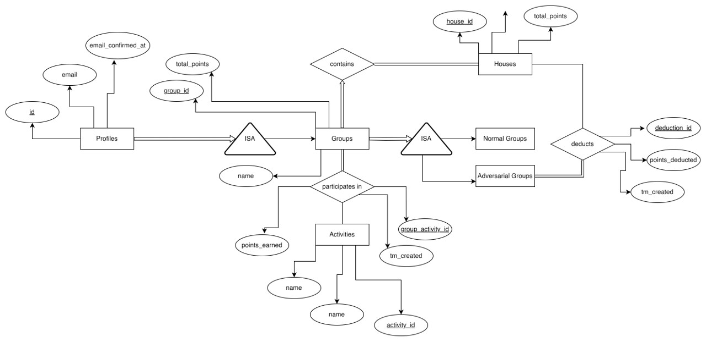
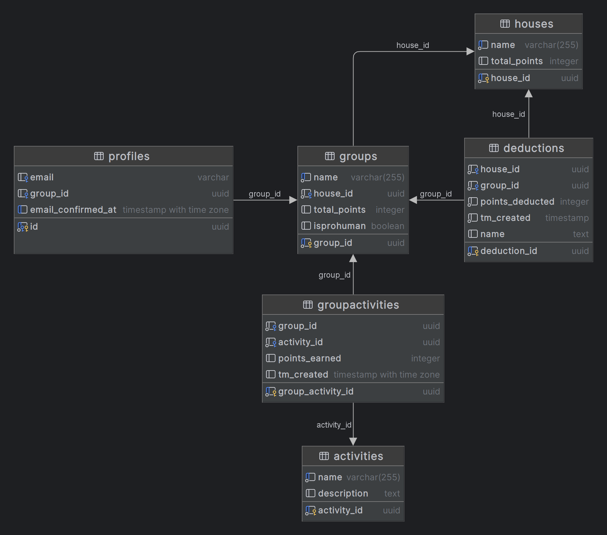

# Database for Insieme Dashboard
This documentation provides a comprehensive overview of the schema, tables, and functions designed for managing a system of houses, groups, activities, group activities, deductions, and profiles. It outlines the relationships between these entities, permissions, and triggers implemented to ensure data integrity and automate data management.
## ER Diagram

<table>
  <tr>
    <td></td>
    <td></td>
  </tr>
</table>

### **Tables**

- **houses**: Stores information about different houses, including a unique ID, name, and total points.
- **groups**: Contains details on groups, linking them to houses, and tracks total points and whether the group is pro-human.
- **activities**: Lists activities available for groups to participate in, with descriptions.
- **groupactivities**: Records instances of groups participating in activities, including points earned and creation time.
- **deductions**: Tracks points deducted from groups or houses, specifying the reason and time of deduction.
- **profiles**: Maintains user profiles, including email verification status.

### **Policies**

- **Read Access for Authenticated Users**: Ensures that only authenticated users can read data from tables.
- **Insert Access for Authenticated Users**: Allows only authenticated users to insert data into specific tables.
- **Delete Access for Authenticated Users**: Permits only authenticated users to delete records from specified tables.

### **Grants**

Permissions for delete, insert, references, select, trigger, truncate, and update operations are granted to three roles: **`anon`**, **`authenticated`**, and **`service_role`**, across all tables.

### **Functions and Triggers**

- **handle_new_user**: Inserts a new profile for each new user.
- **update_points_after_activity**: Updates the total points for groups and their corresponding houses after a group activity.
- **check_isprohuman**: Ensures that deductions meet specific conditions regarding the pro-human status of groups.
- **update_points_after_deduction**: Adjusts total points for groups and houses following a deduction.
- **verify_house_id_match**: Checks that the house_id in profiles matches the house_id in groups.
- **fetch_group_data**: Returns data for a user's group.
- **get_activity_data**: Retrieves details of activities a group has participated in.
- **check_user_verified_status**: Checks if a user's email is verified.
- **update_profile_on_email_confirm**: Updates profiles upon email confirmation.
- **remove_points_from_house**: Subtracts points from a house's total points.
- **remove_points_on_activity_delete**: Adjusts points when an activity record is deleted.

### **Usage**

This schema and its accompanying functions and triggers are designed to be used in applications that require detailed tracking of user groups, activities, and points management. It facilitates complex operations like points calculation, access control based on authentication status, and automated maintenance of consistency across related records.

### **Installation**

To set up this schema in your PostgreSQL database, execute the provided SQL statements in your database management tool. Ensure that the **`uuid-ossp`** extension is enabled in your PostgreSQL instance to use the **`uuid_generate_v4()`** function for generating unique identifiers.

### **Contributing**

Contributions to this project are welcome. Please ensure that any pull requests or issues adhere to the project's standards for data integrity and security.

## **License**

This project is open-source and available under the MIT License.